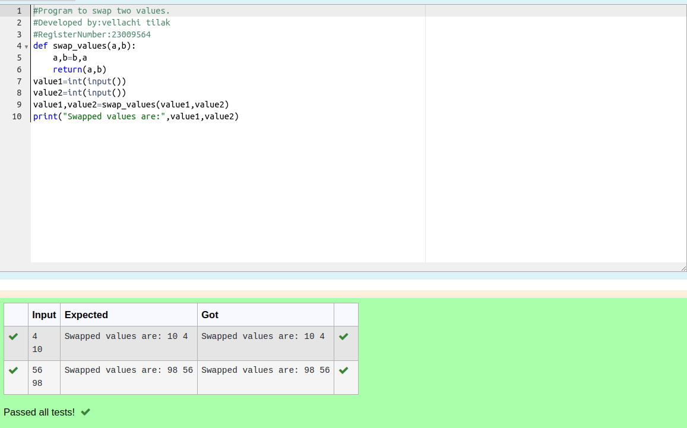

# Swapping-two-values
## AIM:
To write a python program for swapping of two values
## EQUIPEMENT'S REQUIRED: 
PC
Anaconda - Python 3.7
## ALGORITHM: 
### Step 1:
Get the two values from the user
### Step 2: 
Assign the value of second variable to a temporary variable 
### Step 3: 
Assign the value of the first variable to the second variable.
### Step 4:  
Assign the value in temporary variable to the first variable
### Step 5: 
Print both the values it would be interchanged
### Step 6: 
End the program
## PROGRAM:
```
#Program to swap two values.
#Developed by:vellachi tilak
#RegisterNumber:23009564
def swap_values(a,b):
    a,b=b,a
    return(a,b)
value1=int(input()) 
value2=int(input())
value1,value2=swap_values(value1,value2)
print("Swapped values are:",value1,value2)    
```
## OUTPUT:



## RESULT:
Thus the swapping of two values are successfully executed


